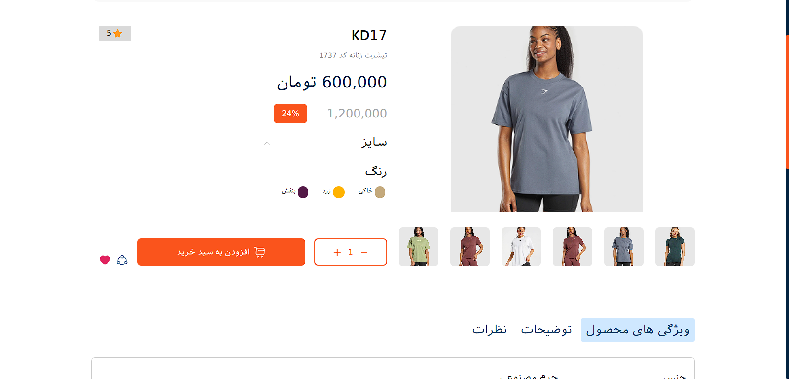
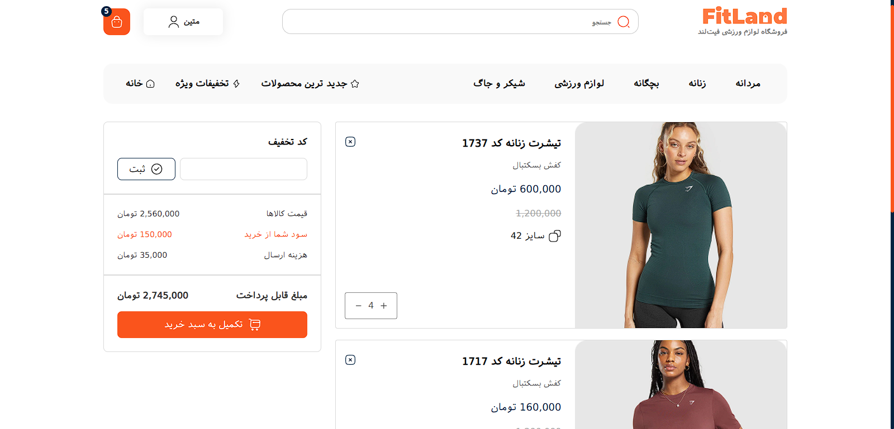
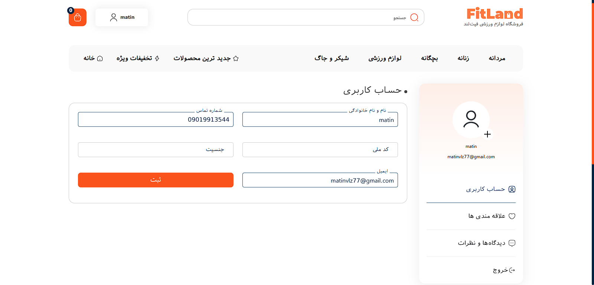
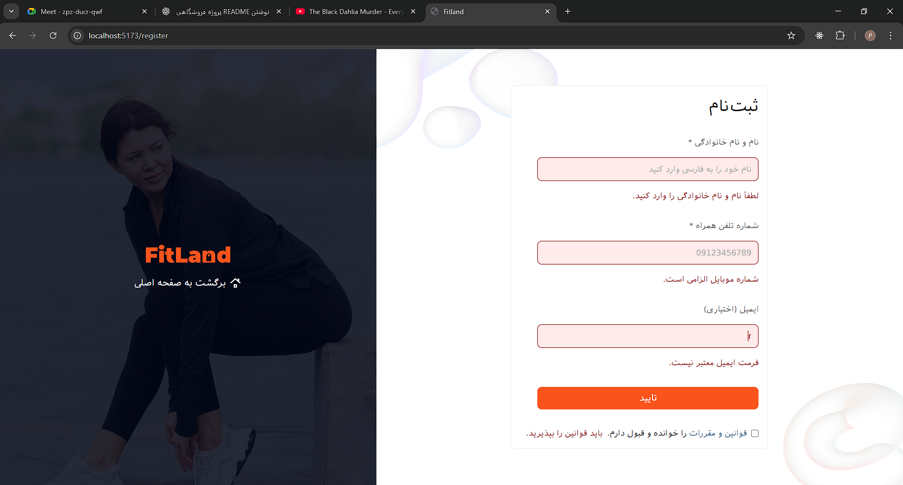

# 🏋️‍♂️ Fitland – Online Sports Equipment Store

## 📖 Overview
**Fitland** is a fully responsive e-commerce web application built with **React**, **TypeScript**, and **pure CSS**.  
Users can browse, filter, like, and purchase various sports products.  
All user data, profiles, and cart information are stored locally using **LocalStorage**, ensuring a fast, backend-free experience.

---

## 🚀 Features
- 🎨 **Fully Responsive Design** – Optimized for all screen sizes  
- 🏋️‍♀️ **Product Display & Selection** – Browse and view detailed product info  
- 🛒 **Shopping Cart** – Add, remove, and manage items easily  
- 💳 **Price Filtering** – Filter products dynamically based on price range  
- ❤️ **Favorites & Like System** – Save and like your preferred items  
- 🔗 **Product Sharing** – Share product links with others  
- 👤 **Login & Register** – Regex-based authentication with validation  
- 🧾 **Multiple Account Support** – Create unlimited accounts without overwriting previous ones  
- 🔐 **Persistent User Profile** – All data stored securely in LocalStorage  
- 🚪 **Logout Functionality** – Manage sessions with one click  
- ⚙️ **404 Page Handling** – Custom Not Found page for invalid routes  
- ⚡ **Lightweight UI** – Built with pure CSS, no external frameworks  

---

## 🧰 Tech Stack

| Category | Technology |
|-----------|-------------|
| **Frontend** | React + TypeScript |
| **Styling** | Pure CSS |
| **State & Storage** | LocalStorage |
| **Form Validation** | Regex |
| **Version Control** | Git & GitHub |

---


## 🌐 Live Demo
🔗 [View Website](https://fitland-team.github.io/fitland-shop/)

---

## 📸 Screenshots

| Home | Products | ProductDetails | Cart | Profile | Login | Register | Notfound |
|------|-----------|----------------|------|----------|--------|-----------|-----------|
|  |  |  |  |  |  |  |  |


---

## 👨‍💻 Team
- **[matinvalizadeh](https://github.com/matinvalizadeh)** – Frontend Developer  
- **[ArazMaher](https://github.com/ArazMaher)** – Frontend Developer  

## 👥 Team Collaboration
Fitland was built by a small team of two developers working closely together.  
We used GitHub for collaboration, handled branches and pull requests,  
and practiced proper commit conventions to simulate a real-world team workflow

---

## 🧠 What We Learned
- Effective team collaboration with Git & GitHub  
- Handling user data with LocalStorage  
- Building responsive layouts with pure CSS  
- Managing state without external libraries  

---

## ⚙️ Installation & Setup

```bash
# 1. Clone the repository
git clone https://github.com/Fitland-team/fitland-shop.git

# 2. Navigate into the project directory
cd fitland-shop

# 3. Install dependencies
npm install

# 4. Run the app locally
npm run dev


